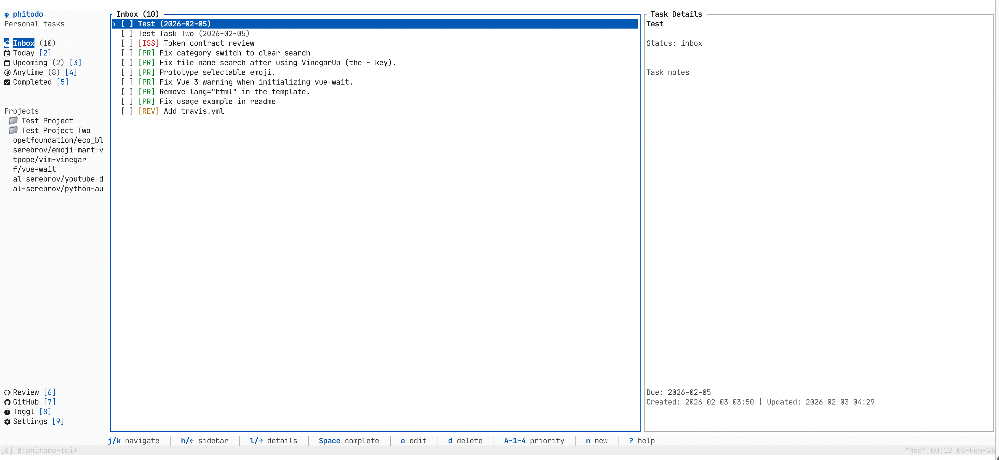

# phitodo-tui

A terminal UI clone of phitodo task management, built with Rust using ratatui.

A port of https://github.com/pichichi91/phitodo to TUI/rust app.
Ported by Claude Code.



## Features

- Full task management (create, edit, complete, delete)
- Multiple views: Inbox, Today, Upcoming, Anytime, Completed, Review
- Project and tag organization
- **GitHub integration** with automatic task sync:
  - Assigned issues, your PRs, and review requests become tasks
  - Auto-creates projects per repository
  - Tasks auto-complete when GitHub items are closed
  - Distinct task kinds: `[ISS]` issues, `[PR]` your PRs, `[REV]` review requests
- Toggl time tracking integration with bar charts
- Vim-like keyboard navigation
- Open task URLs directly in browser
- Configurable settings

## Installation

```bash
cargo build --release
./target/release/phitodo-tui
```

## Keyboard Shortcuts

### View Switching
| Key | View |
|-----|------|
| `1` | Inbox |
| `2` | Today |
| `3` | Upcoming |
| `4` | Anytime |
| `5` | Completed |
| `6` | Review |
| `7` | GitHub |
| `8` | Toggl |
| `9` | Settings |

### Navigation
| Key | Action |
|-----|--------|
| `j/k` or `Down/Up` | Navigate list |
| `h/l` or `Left/Right` | Move between sidebar/list/detail |
| `g/G` | Go to first/last item |
| `Tab/Shift+Tab` | Cycle focus |
| `Enter` | Open selected item |

### Task Actions
| Key | Action |
|-----|--------|
| `Space` | Toggle task completion |
| `n` | New task |
| `N` | New project |
| `e` | Edit selected |
| `d` | Delete (with confirmation) |
| `o` | Open task URL in browser |
| `Alt+1` | Priority: None |
| `Alt+2` | Priority: Low |
| `Alt+3` | Priority: Medium |
| `Alt+4` | Priority: High |
| `i/a/s` | Move to Inbox/Active/Scheduled |

### Other
| Key | Action |
|-----|--------|
| `/` | Search/filter |
| `r` | Refresh data (also syncs GitHub) |
| `?` | Show/hide help |
| `q` | Quit |

## GitHub Integration

When you configure a GitHub token and refresh (`r`), the app will:

1. **Sync GitHub items to tasks**:
   - Issues assigned to you
   - Pull requests you authored
   - PRs where your review is requested

2. **Auto-create projects** for each repository

3. **Track task types** with distinct indicators:
   - `[ISS]` (red) - GitHub issues
   - `[PR]` (green) - Your pull requests
   - `[REV]` (orange) - Review requests

4. **Auto-complete tasks** when the corresponding GitHub issue/PR is closed

5. **Store issue description** in task notes

Press `o` on any GitHub-synced task to open it in your browser.

## Configuration

Configuration is stored at `~/.config/phitodo-tui/config.toml`:

```toml
github_token = "ghp_..."
toggl_token = "..."
toggl_hidden_projects = ["Internal"]
```

Database is stored at `~/.local/share/phitodo-tui/phitodo.db`

## Views

1. **Inbox** - Tasks with status=inbox
2. **Today** - Tasks due today or overdue
3. **Upcoming** - Tasks with future due dates
4. **Anytime** - Tasks with no due date
5. **Completed** - Completed tasks
6. **Review** - Overdue tasks
7. **GitHub** - 3-column view: Review PRs | My PRs | Assigned Issues
8. **Toggl** - Time entries with bar chart and project distribution
9. **Settings** - GitHub token, Toggl token configuration

## Task Kinds

| Kind | Symbol | Color | Description |
|------|--------|-------|-------------|
| Task | `[T]` | Blue | General task |
| Bug | `[B]` | Red | Bug fix |
| Feature | `[F]` | Green | New feature |
| Chore | `[C]` | Orange | Maintenance |
| GitHub Issue | `[ISS]` | Red | Assigned GitHub issue |
| GitHub PR | `[PR]` | Green | Your pull request |
| GitHub Review | `[REV]` | Orange | Review request |

## Tech Stack

- **TUI Framework**: ratatui + crossterm
- **Async Runtime**: tokio
- **Database**: rusqlite (bundled SQLite)
- **HTTP Client**: reqwest
- **Serialization**: serde, serde_json, toml
- **Date/Time**: chrono

## License

MIT
